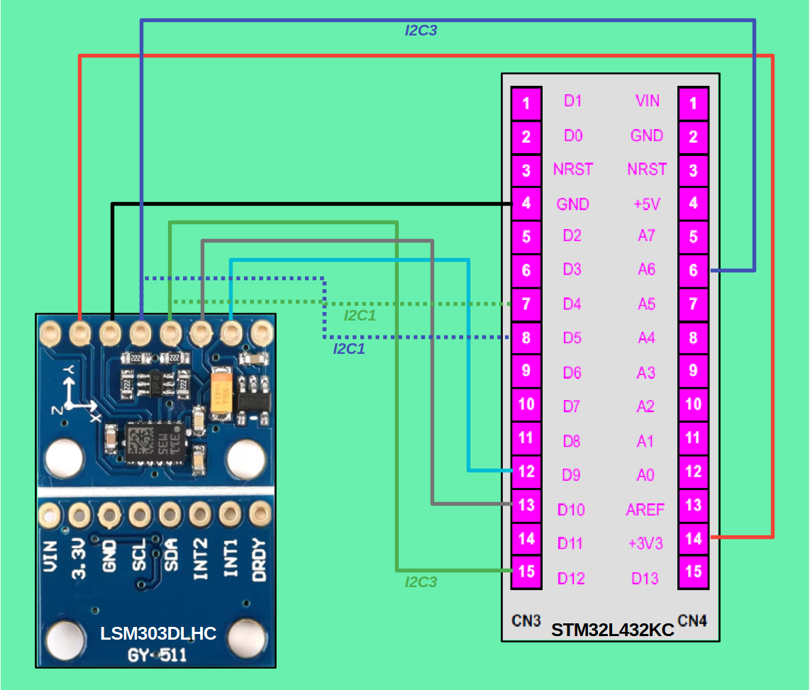

# Simple LSM303DLHC Library for STM32

Library for using LSM303DLHC (GY-511) sensor by STM32  
Tested on **LSM303DLHC** connected via **I2C3** to **ESP32 Nucleo L432KC**

## Features:

*   Configure linear accelerometer and magnetic field sensors
*   Read data from linear accelerometer and magnetic field sensors (raw data and convertion to sensor units)
*   Configure interrupts
*   Motion detection by linear accelerometer
*   Detection of magnetic field distortion
*   Orientation: pitch, roll and yaw
*   Compute incline angle

## Pinout

### I2C1

| LSM303DLHC | STM32L432KC |
| --- | --- |
| 3V3 | 3V3 |
| GND | GND |
| SCL | D5 (PB6) |
| SDA | D4 (PB7) |
| INT1 | D9 (PA8) _for using IRQ_ |
| INT2 | D10 (PA11) _for using IRQ_ |

### I2C3

| LSM303DLHC | STM32L432KC |
| --- | --- |
| 3V3 | 3V3 |
| GND | GND |
| SCL | A6 (PA7) |
| SDA | D12 (PB4) |
| INT1 | D9 (PA8) _for using IRQ_ |
| INT2 | D10 (PA11) _for using IRQ_ |



## Project migration from STM32CubeMX to Visual Studio Code

1.  Configure the project in [STM32CubeMX](https://www.st.com/en/development-tools/stm32cubemx.html) and generate the source code.
2.  Then create a project in [Visual Studio Code](https://code.visualstudio.com/) + [PlatformIO](https://platformio.org/) extension:
    *   **Board:** ST Nucleo L324 KC
    *   **Framework:** STM32Cube
3.  Copy/move the generated source files from the STM32CubeMX project to the **src** subdirectory of Your VS Code project.
4.  For using on-chip floating point unit. The **stm32flags.py** file contains additional framework build flags. Include it in Your **platformio.ini** and add build flags:

```
extra_scripts = pre:stm32flags.py
build_flags =
    -Wall
    -mfpu=fpv4-sp-d16 -mfloat-abi=hard
    -Wl,-u,_printf_float
```

## Examples
Directory **example/src** cantain files, generated in **STM32CubeMX** for **STM32L432KCU3**  
In  other **example** subdirectories cantain appropriate **main.c** for interested example
